# Comms — user guide

**Download Comms 0.5** (pick the one matching your ATAK-CIV version, sideload, then load it in ATAK's Plugins manager):

- **ATAK-CIV 5.6:** https://github.com/takwerx/comms/releases/download/v0.5/ATAK-Plugin-Comms-0.5--5.6.0-civ-release.apk
- **ATAK-CIV 5.7:** https://github.com/takwerx/comms/releases/download/v0.5/ATAK-Plugin-Comms-0.5--5.7.0-civ-release.apk
- **ATAK-CIV 5.8:** https://github.com/takwerx/comms/releases/download/v0.5/ATAK-Plugin-Comms-0.5--5.8.0-civ-release.apk

All releases: https://github.com/takwerx/comms/releases

## Before you start

Published builds exist for ATAK-CIV 5.6, 5.7 and 5.8. Match the build to the ATAK
you are running; a plugin built for one release will not load on another.

The reach check needs elevation data on the device. Map Depot's DTED packs
provide it, and without them the check says so rather than guessing.

## What it does

Mountaintop radio sites on the map, nearest first, with the nets that live on each
one and the tone that opens each repeater. It answers "what is the closest Command
5 repeater, what mountain is it on, and what tone does it use" — and then, if you
ask it to, which of those mountains you are likely to reach from where you are
standing.

Open it from the Comms button in ATAK's toolbar.

The pane opens on the right. The top line always says what you are looking at and
what is being held back, and the button beside it draws the sites on the map or
takes them off.

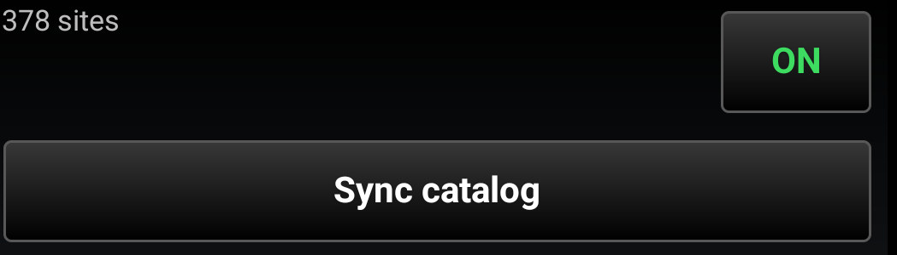

## Finding a site or a net

Type in the search box. It matches site names, net names and designators, tones —
by number or in Hz — and callsigns.

Searching a **net** gives you every mountain that carries it, nearest first, with
that net's tone at each one. This is the question the plugin exists for: you know
you need Command 1, and you want the nearest hill that will give it to you.

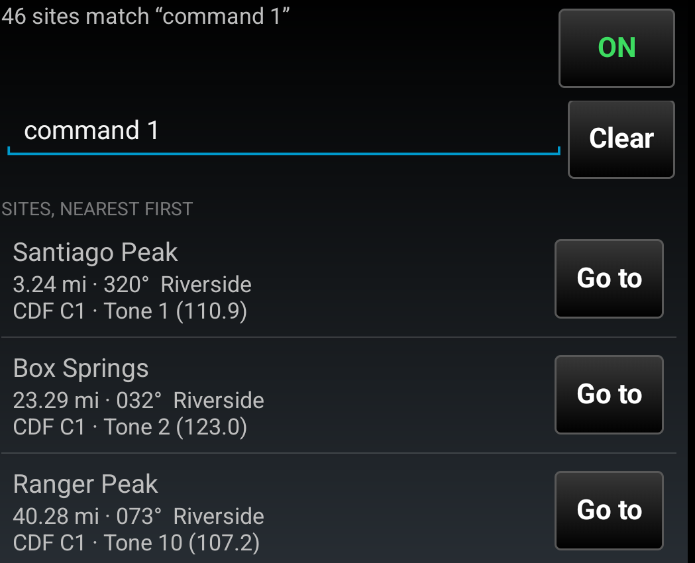

It is loose about how you type a designator. "CDF Command 5", "CDF C5" and "cdf 5"
all find the same net, so you can type what you would say on the radio.

Searching a **site** gives you the mountain and everything on it.

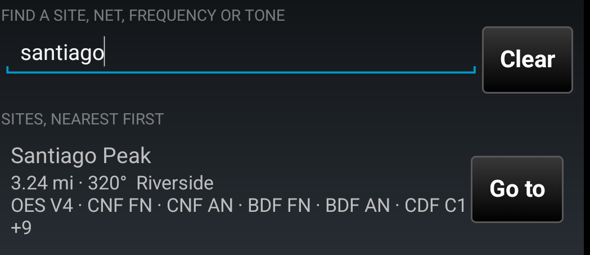

A few nets have no mountain at all — an incident portable repeater is carried to
the fire and set up there. Rather than show you an empty list, the plugin says so.

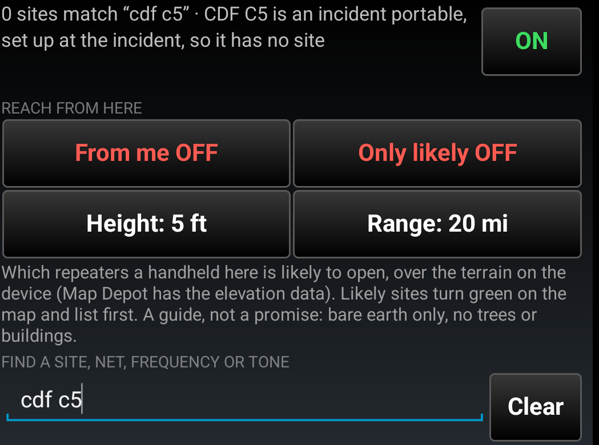

## Narrowing the list

**Where** sets the state, whether distances are measured from you or from the
center of the map, and how far out to include.

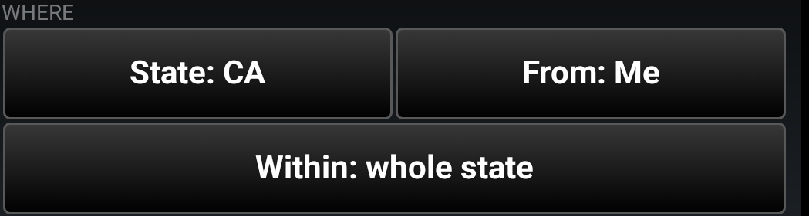

**Show** is one checkbox per agency, each carrying the number of sites it would
add, so you can see what a filter costs before you use it.

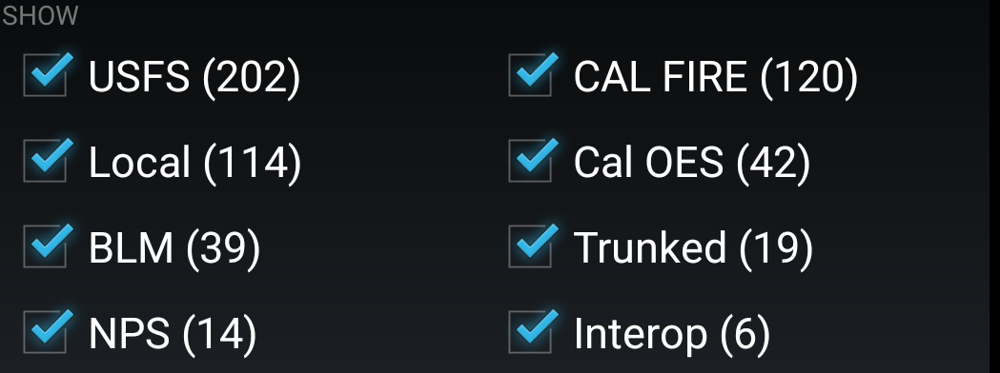

The list is nearest first. Each row gives the site, how far and what bearing, its
county, and the nets on it.

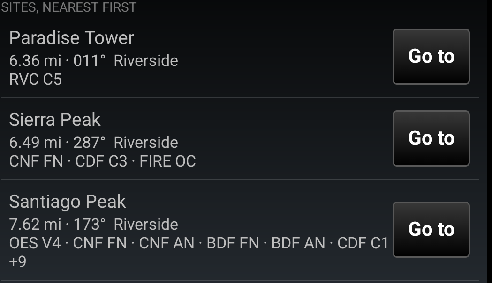

## Site details

Tap a row — or **Details** on a site's radial menu — for the county, elevation,
distance and bearing, and every net on the mountain with the tone that opens it.

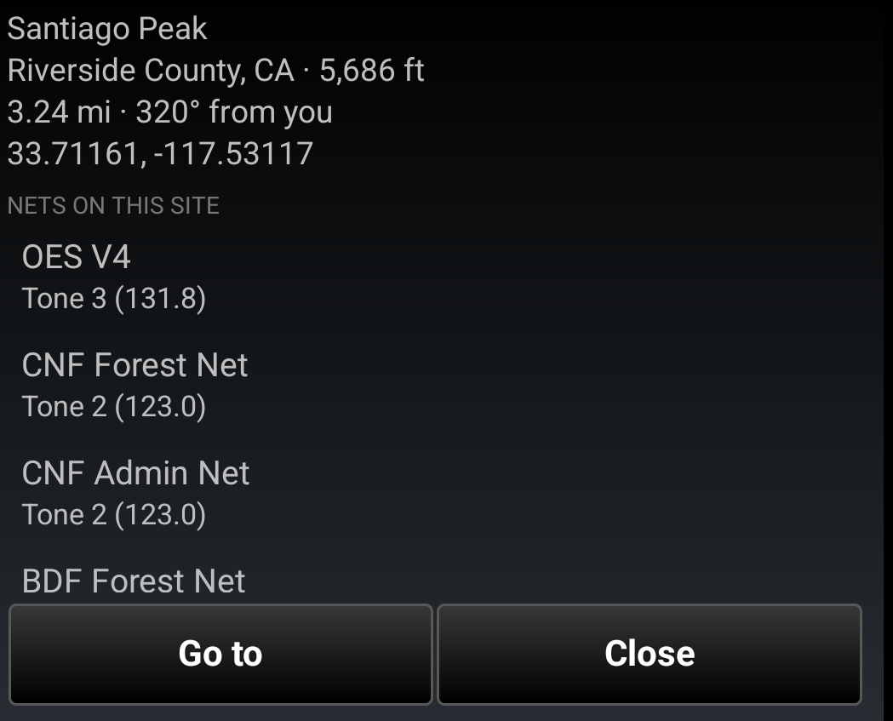

One tone per net, and it is the one you transmit to key that repeater. Call plans
print two, but the other belongs to the net and is the same at every site on it,
so it can never tell you which mountain to use. Where the catalog does not hold a
tone, the row says which kind of nothing it is — a digital trunked channel has no
CTCSS tone at all, and a plan can withhold one — rather than leaving you to guess.

A mountain often carries several agencies, each on its own tone. Sierra Peak has
the Cleveland National Forest, CAL FIRE and Orange County on it, on three
different tones:

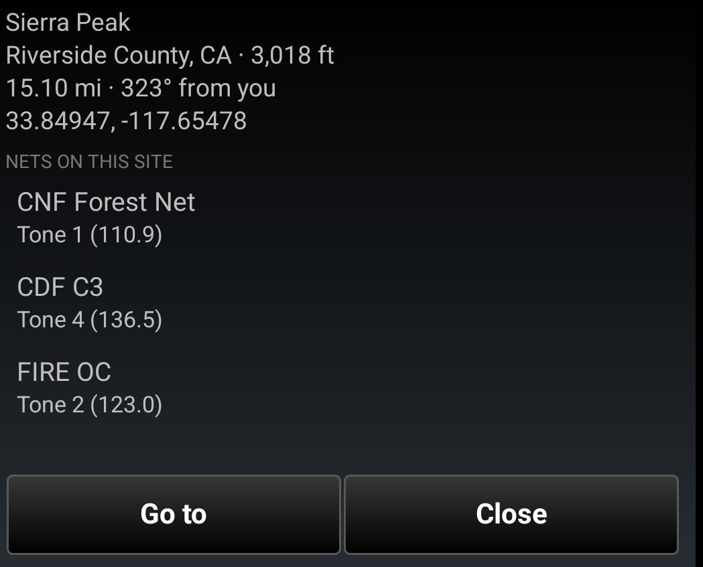

## On the map

Sites draw as the NWCG repeater symbol, named, once you are zoomed in far enough
to make sense of them.

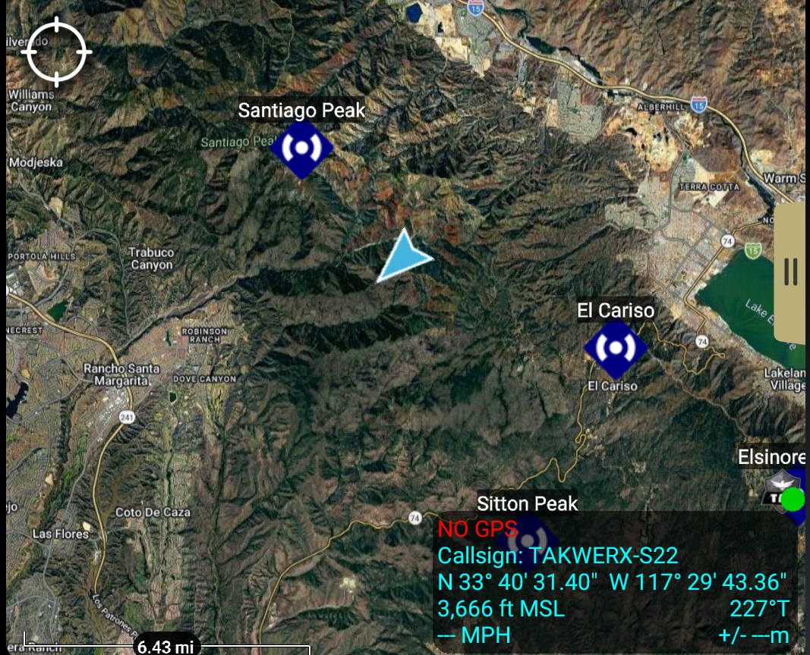

**Draw on the map** sets that zoom, quoted as what the scale bar reads, so you can
match it to how you actually work rather than to a number.

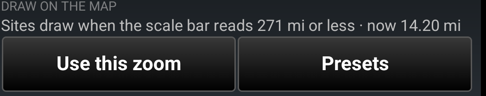

Tapping a site opens ATAK's radial menu on it, with Details, a pairing line and
polar.

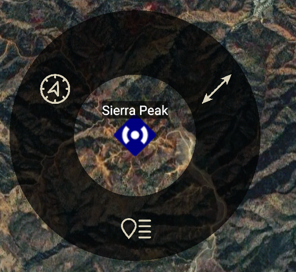

## Which repeaters can I reach from here

**From me ON** works out, for every site within **Range**, whether a handheld
where you are standing is likely to open it.

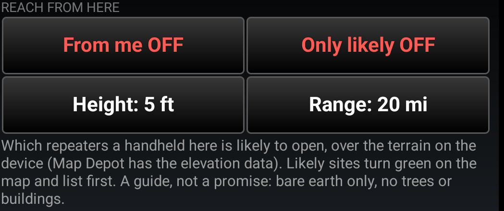

It walks the terrain between you and the antenna over the elevation data on the
device, scores the worst ridge in the way for the loss a signal takes bending over
it, and weighs that against what a handheld into a mountaintop repeater can
afford. **Height** says how high your own antenna is, from a handheld at head
height to a tower.

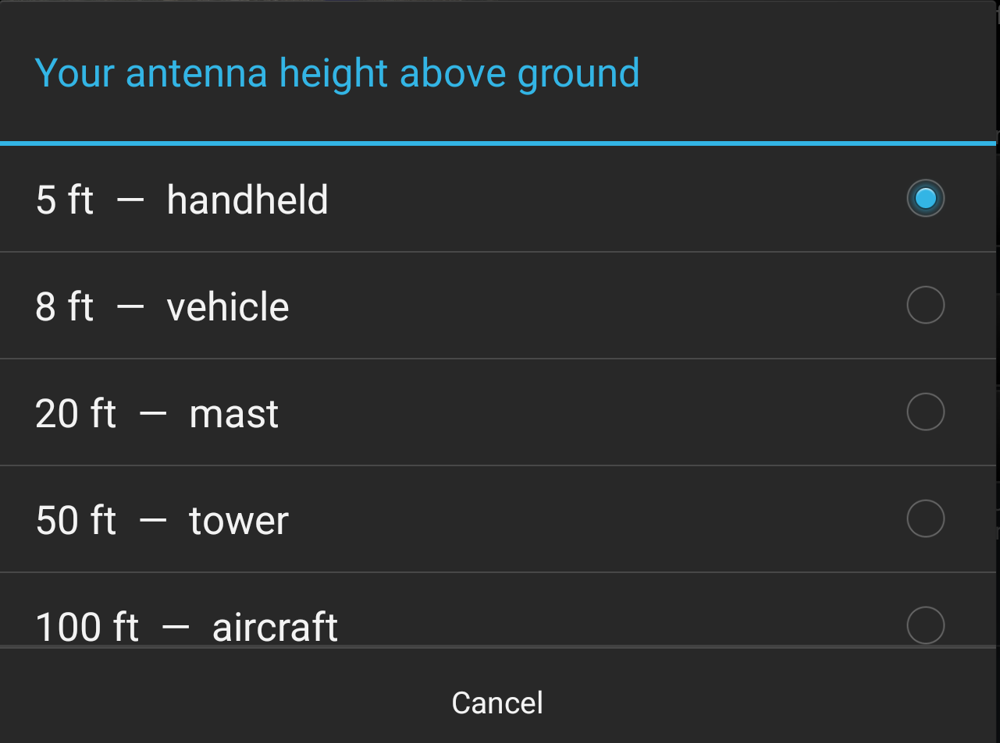

Sites you are likely to reach light their symbol green on the map.

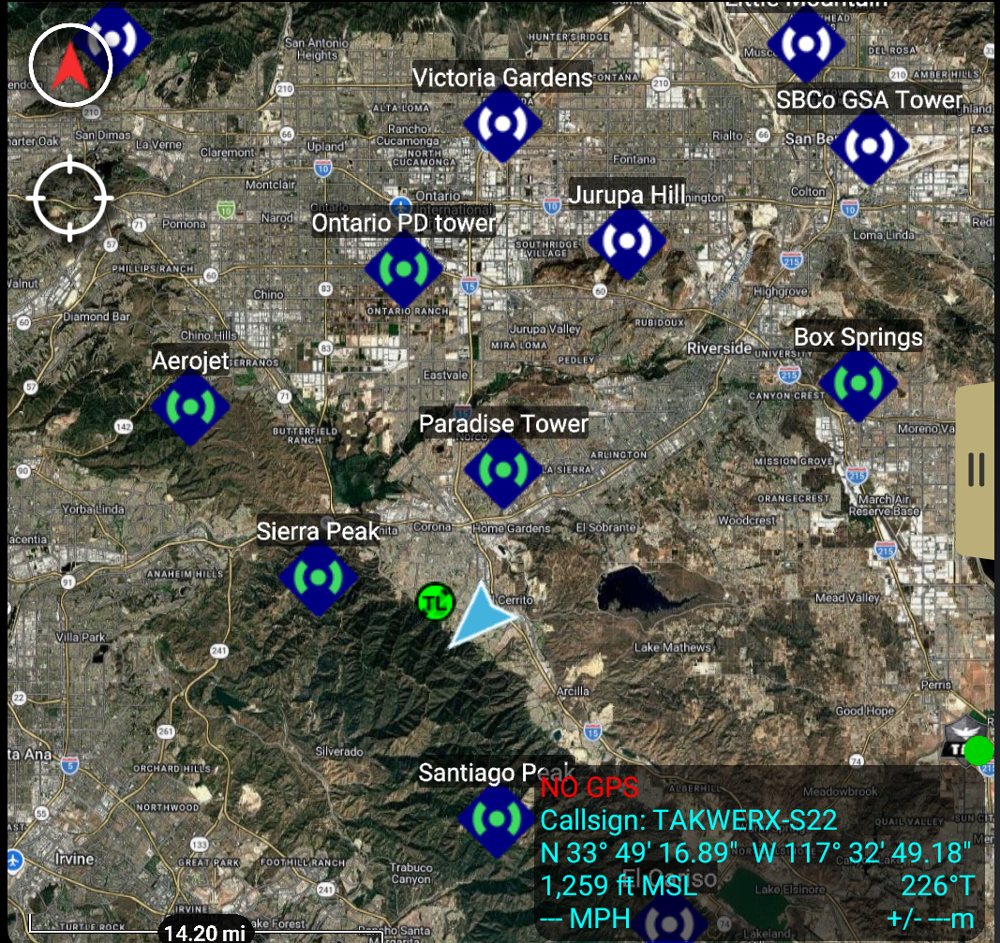

In the list they sort to the top under **Likely from here**, with **Marginal** and
**Unlikely** below them and anything past the range listed as not checked. The
groups only appear when something falls into them.

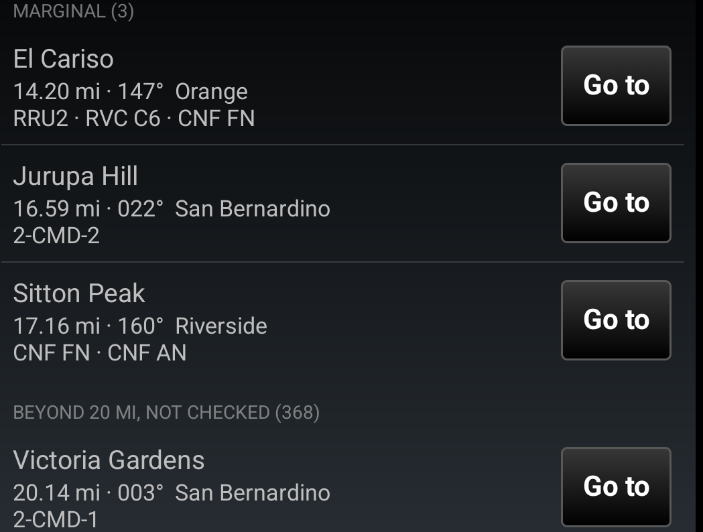

**Only likely** puts the rest away, map and list together, for when you just want
the ones worth trying. The status line says how many it is holding back.

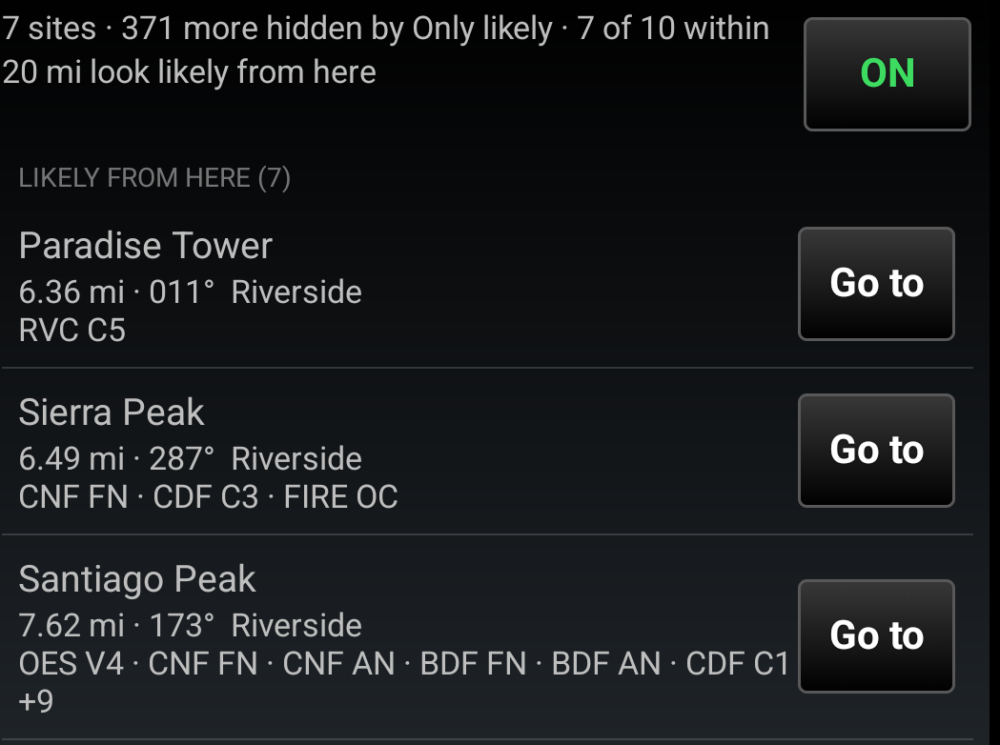

The answer follows you as you move, and the status line counts the sites off while
it works. With a search running, the top row is the nearest matching site you are
likely to reach.

> **This is a guide, not a prediction.** It is bare earth: it knows nothing about
> trees, buildings, vehicles or weather, it assumes one ridge rather than a range
> of them, and it assumes a handheld rather than the radio in your hand. A site it
> calls unlikely is still worth a try, and a site it calls likely can still fail.
> Confirm on the radio.

### Why there is no coverage picture

Nothing here paints coverage on the map, and that is deliberate.

Drawn from a repeater, a viewshed reads as a coverage map and is not one — it is
bare-earth line of sight, pessimistic wherever a signal would bend into a valley
and silent about whether your handheld can make the uplink back.

Drawn from you, ATAK's own viewshed has a subtler problem: it samples on a fixed
grid however large an area you ask it to cover. At a five-mile range its cells are
about 30 m; at fifty miles they are about 320 m, wide enough to smooth a blocking
ridge away entirely. The same mountain was painted visible at one range setting
and hidden at another. A picture that changes its answer with a display setting is
worse than no picture.

The reach check is worked out per site, at the same resolution whatever the range,
so **Range** decides only how far to look — never what the answer is.

## The catalog

Sites and nets come from a catalog the plugin refreshes from the depot once a day,
and on **Sync catalog**. The status line says which copy you are looking at and
how old it is. It works offline from its built-in copy, and adding a site or a net
is a catalog change rather than a new plugin release.

## Documentation on the device

The same guide ships inside the plugin as a PDF. Open it from **Settings → Tool
Preferences → Comms**.

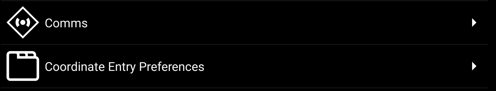

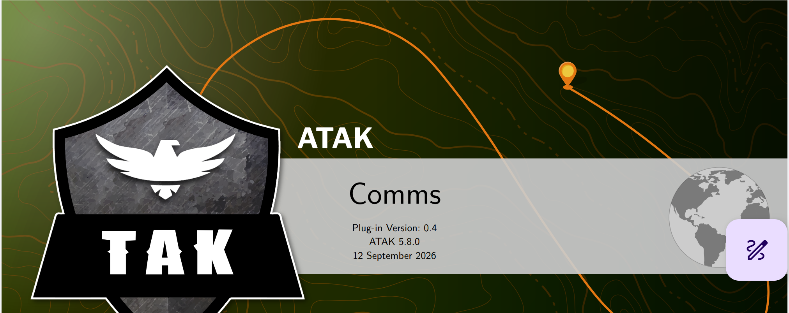

## Problems

**Nothing is drawing on the map.** The pane says why, in amber, at the front of
the status line: either the map toggle at the top is off, or you are zoomed out
past the draw limit.

**Every site says the reach is unknown.** There is no elevation data for where you
are. Map Depot's DTED packs provide it.

**The plugin will not load.** Check that the build matches your ATAK version —
5.6, 5.7 and 5.8 have separate downloads at the top of this page.

Bugs and requests: https://github.com/takwerx/comms/issues
